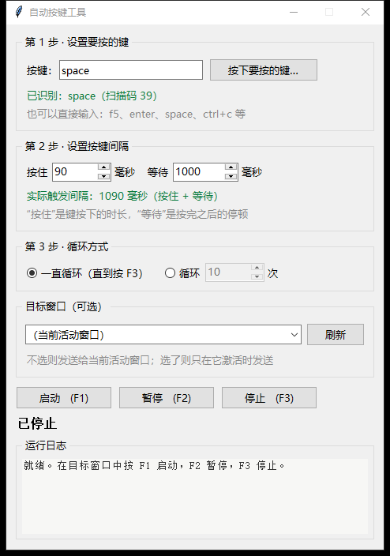
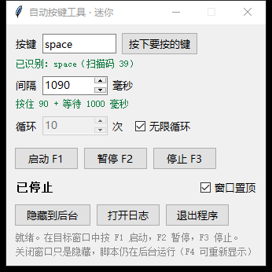
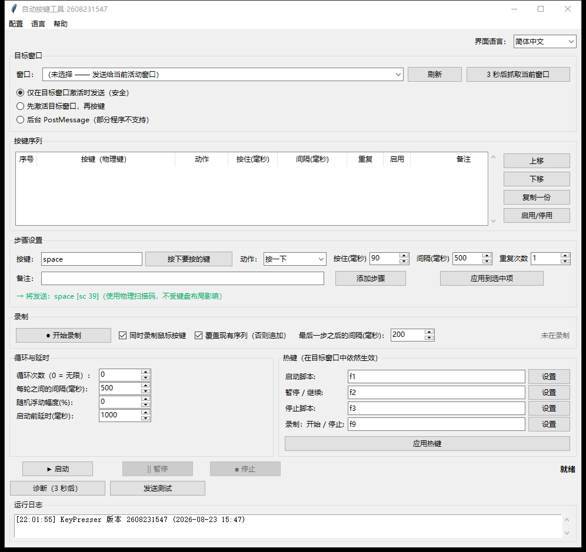

# 自动按键工具（KeyPresser 中文版）

Windows 自动连按工具：设定要按的键和间隔，通过全局热键在目标程序获得焦点时自动重复按键。
基于开源项目 [arkhamvm/keypresser](https://github.com/arkhamvm/keypresser)（MIT 许可）改造，
补齐全中文界面并新增三种界面形态。仅依赖 Python 标准库（tkinter），Windows 10/11 可用。

| 简洁版（默认） | 迷你版 | 完整版 |
|---|---|---|
|  |  |  |

## 主要功能

- **三种界面，同一套核心**
  - **简洁版**（默认）：三步直线流程——按键 → 间隔 → 循环，隐藏全部进阶选项
  - **迷你版**：330×307 浮动小窗，默认置顶；关窗口只是隐藏（F4 呼回），脚本在后台继续跑
  - **完整版**：上游原版界面（已中文化），支持步骤序列编辑、按键录制、诊断、配置档案、多种发送模式、随机抖动
- **全局热键**：`F1` 启动 / `F2` 暂停继续 / `F3` 硬停止 / `F4` 最小化（迷你版为显示/隐藏窗口），可在完整版中改绑
- **按键按物理扫描码经 `SendInput` 发送**：不受键盘布局影响，DirectInput / RawInput 类程序也能收到
- **按键写法**：键名（`space`、`f5`、`num7`…）、组合键（`ctrl+c`）、原始扫描码（`sc:0x11`）、虚拟键码（`vk:0x41`）、鼠标键（`mouse_left`）
- **间隔 = 按住 + 等待**（毫秒），界面实时显示合计；按住建议 80–120ms，太短会被按帧轮询键盘的程序吞掉
- **安全细节**
  - 简洁版点「启动」先进入 3 秒待命倒计时，结束时自动把焦点还给上一个前台窗口
  - 停止时强制释放所有仍按住的键，不会卡键；F3 约 10ms 内生效
  - 目标程序以管理员运行时提示并支持一键提权重启（Windows 会静默丢弃低权限进程的模拟输入）
- **文件日志**：`%APPDATA%\KeyPresser\logs\keypresser.log`（1MB×5 轮转、UTF-8、含未捕获异常堆栈）

## 目录结构

```
按键精灵\
├── 启动KeyPresser.bat          简洁版启动入口（默认）
├── 启动KeyPresser-迷你版.bat    迷你浮动窗口启动入口
├── 启动KeyPresser-完整版.bat    完整版启动入口
├── 使用说明.md                  详细使用说明（热键逻辑、间隔计算、改动清单、排查指南）
├── 界面预览-*.png               三种界面截图
├── _smoke_test.py              自检脚本（16 项）
├── _launch_test.py             端到端启动测试
├── _shot.py                    界面截图工具
├── tests\                      单元测试（67 项，纯 unittest 零依赖）
├── deliverables\audit\         需求符合度 / 架构 / 质量审核报告
└── KeyPresser\                 源码
    ├── main.py                 入口（无参数=简洁 / mini / full 三种模式路由）
    ├── gui_simple.py           简洁中文界面（含全部业务逻辑）
    ├── gui_mini.py             迷你浮动窗口（继承简洁版，只重画界面）
    ├── gui.py                  完整版界面（上游原版，已中文化）
    ├── engine.py               播放引擎（相对上游最小改动：修复长按住卡键）
    ├── hotkeys.py              全局热键（RegisterHotKey + 消息循环，与上游一致）
    ├── sender.py               SendInput 扫描码发送（与上游一致）
    ├── keys.py                 键名/键码映射（与上游一致）
    ├── winutil.py              窗口与权限检测（与上游一致）
    ├── recorder.py             按键录制（与上游一致）
    ├── applog.py               文件日志（新增，含异常接管）
    ├── profiles.py             配置存档、默认热键、运行参数校验
    ├── i18n.py                 语言包（新增中文共 203 条，EN/ZH/RU 三方一致）
    ├── instance.py             单实例互斥、提权重启
    ├── ui_fx.py                UI 动效（状态点呼吸、窗口淡入淡出）
    ├── build.bat               PyInstaller 打包脚本
    └── run.bat / run_admin.bat 源码运行 / 管理员运行
```

## 运行使用

### 方式一：打包版（免安装，需自行打包或从 Release 获取）

双击 `KeyPresser.exe` = 简洁版；`KeyPresser.exe mini` / `full` = 迷你版 / 完整版。
打包方法：`cd KeyPresser && build.bat`（需 PyInstaller），产物约 11MB 单文件。

### 方式二：源码运行

环境要求：Windows 10/11 + Python 3.11+（标准库即可，含 tkinter），无任何第三方依赖。

```
双击 启动KeyPresser.bat          # 简洁版（推荐）
双击 启动KeyPresser-迷你版.bat    # 迷你版
双击 启动KeyPresser-完整版.bat    # 完整版
```

或命令行：

```
python KeyPresser\main.py          # 简洁版
python KeyPresser\main.py mini     # 迷你版
python KeyPresser\main.py full     # 完整版
```

### 快速上手（简洁版）

1. 点「按下要按的键…」→ 按下要连按的键
2. 填「按住」和「等待」毫秒数（注意：实际间隔 = 两者相加）
3. 设置循环方式（无限或指定次数）
4. 切到目标窗口，按 **F1** 启动，**F2** 暂停/继续，**F3** 停止

### 测试

```
python -m unittest discover -s tests     # 单元测试 67 项
python _smoke_test.py                    # 自检 16 项
```

## 注意事项

1. **同一时刻只能运行一个界面**——全局热键只能归属一个进程，换界面先关掉当前的
2. **迷你版点 ✕ 不是退出**，只是隐藏窗口、脚本继续在后台跑；彻底退出请点「退出程序」
3. 目标程序以管理员运行时，本工具也必须以管理员运行（`run_admin.bat`），否则按键被 Windows 静默丢弃
4. `F1` 是 Windows 通用帮助键，如与目标软件冲突可在完整版中改绑热键
5. 本工具只调用 Windows 公开输入 API，不读写内存、不注入进程、无法绕过反作弊；
   自动化在线程序可能违反其用户协议，请自行评估

详细的热键逻辑、间隔计算规则、问题排查和相对上游的完整改动清单见 [使用说明.md](使用说明.md)。

## 许可

MIT —— 见 [KeyPresser/LICENSE](KeyPresser/LICENSE)。
