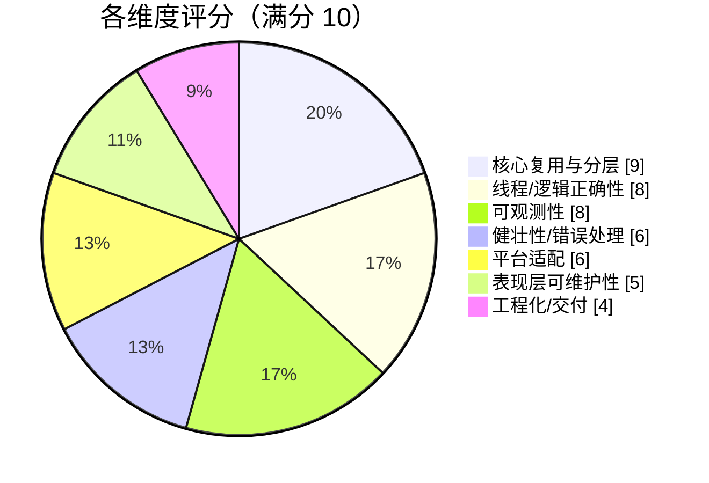
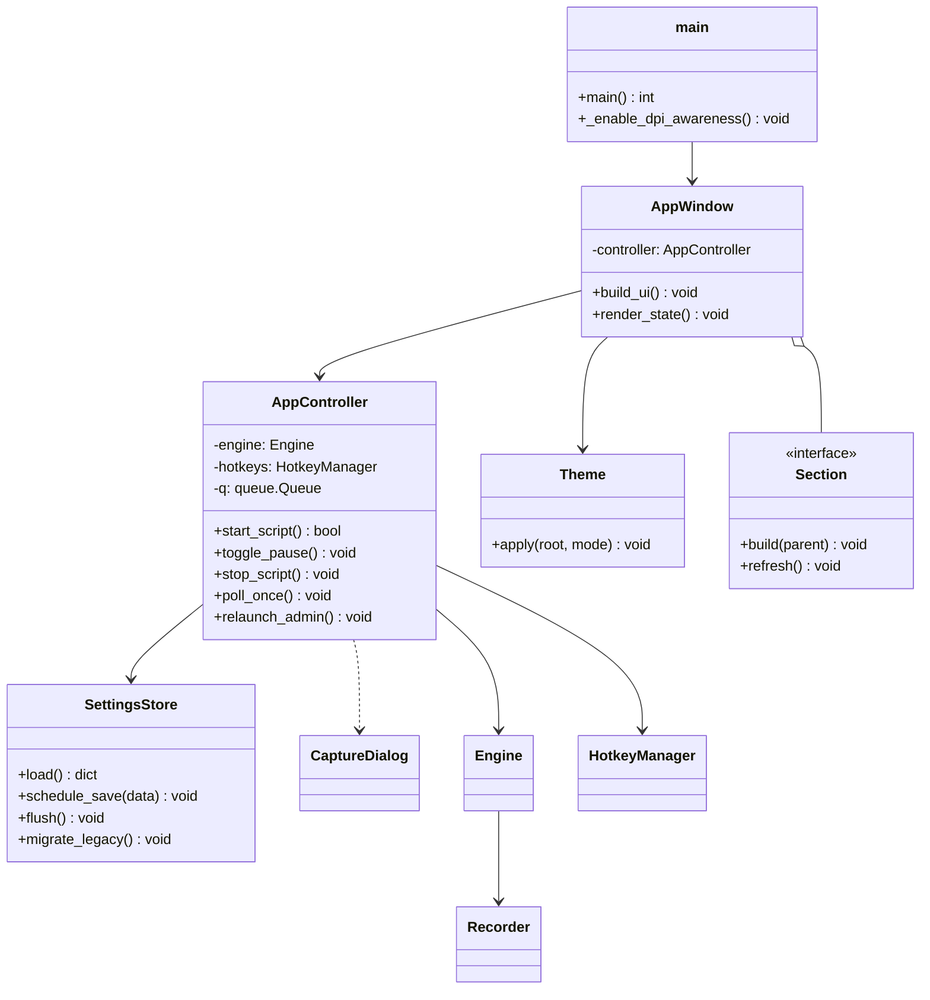
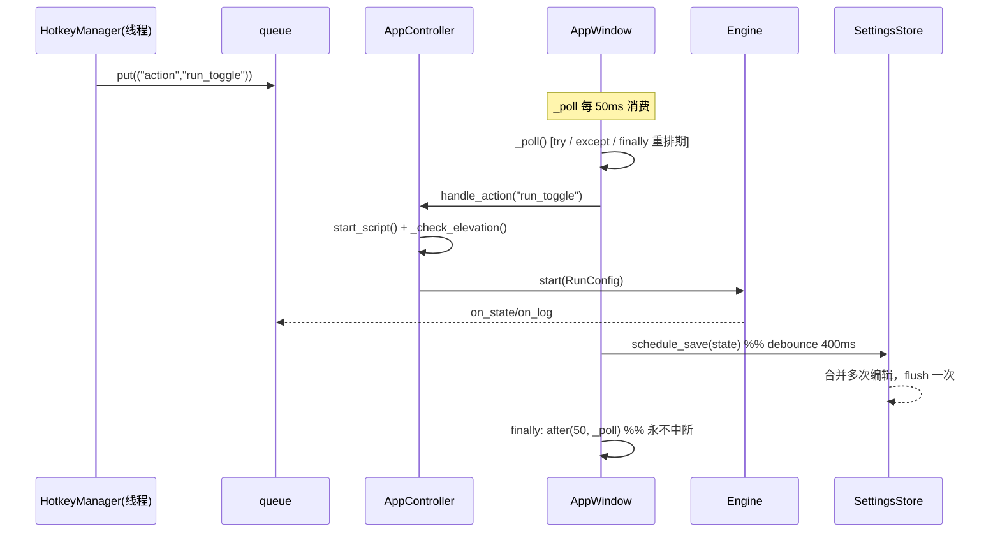

# 02 · 架构与实现评审报告

> 评审对象：`D:\AI\按键精灵`（基于 MIT 开源 `arkhamvm/keypresser` 改造的 Windows 自动按键工具）
> 评审人：架构师 高见远（software-architect）
> 评审性质：**审计 + 改进建议**（不重新设计，不修改 `KeyPresser\` 下任何源码）
> 评审方式：全量通读 9 个核心/新增模块 + `gui.py` 关键路径定位 + 只读 Python 实测取证
> 结论基线：`engine/sender/hotkeys/keys/winutil/recorder` 与上游**逐字节一致**（已采信 F1），
> 本次评审新增结论均已在代码或运行环境中**复核**

---

## 摘要（TL;DR）

- **核心层是一座好地基**：引擎/发送/热键/键表/窗口 6 个模块零改动复用上游，职责清晰、线程模型正确（热键线程 → `queue` → 主线程轮询）。
- **表现层已经分叉到临界点**：`gui.py`（1230 行，上游完整版）与 `gui_simple.py`（498 行，新写，承载全部新逻辑）是**两套并行实现**，外加 `gui_mini.py`（271 行，继承）与**两套配置文件**（`settings.json` / `simple.json`）。用户在**设计稿阶段已决策"合并单一界面"**，但代码未落地。
- 本次复核确认两个**会直接伤害用户的高危缺陷**：① **从迷你版/完整版触发提权重启后，会静默变回简洁版**（命令行参数被丢弃，已实测取证）；② **任意一次轮询回调异常会让 `after` 轮询永久停摆**，此后 F1/F2/F3 全部失效且界面无任何提示。
- **打分：6.7 / 10**（核心 9 分，表现层 5 分，交付/工程化 4 分）。



---

## 一、总体架构评价

1. **分层是干净的、且被刻意守护**：`main.py`（路由/单实例/日志）→ GUI 表现层 → `engine`（播放状态机）→ `sender`（SendInput/PostMessage）/ `hotkeys`（RegisterHotKey 线程）→ `keys/winutil`。上游 6 个核心模块**一行未改**，这是整个改造里最正确、最有价值的决策——它把"中文 + 简洁界面"的改动面收敛在**展示层与语言包**，风险极低。
2. **线程模型正确**：热键在独立线程跑消息循环，结果经 `queue.Queue` 投递主线程按 `POLL_MS` 消费，避开了 tkinter 非线程安全；引擎用 `_stop`/`_resume` 两个 `Event` 做可中断等待，`sender.release_all()` 在 `finally` 兜底。这部分**无需改动**。
3. **但"简洁版"没有真正简洁**：`gui_simple.py` 名义上是"展示层"，实际**承载了全部新业务逻辑**（引擎接线、热键管理、队列轮询、权限预检、存档、扩展点）。它既是具体界面、又是被 `MiniApp` 继承的"基类"，**视与控制器职责混在一起**，导致它无法独立测试，也让"合并"时无法直接复用逻辑层。
4. **三个界面 + 两套存档，是本次改造最大的架构债**：同一语义（如 F1 只启动、F3 停止、按钮状态同步、日志）在 `gui.py` 与 `gui_simple.py` 各写一遍，已出现细微分叉（见 P0-3）。存档分 `settings.json`（完整版）与 `simple.json`（简洁/迷你版），字段重叠但**互不可见**——这正是"提权后换界面 = 数据割裂"的根因。
5. **交付形态偏"开发者本机可用"，非"可分发产品"**：无 exe，3 个 `.bat` 把开发机用户名写死进绝对路径。功能可用，但作为交付物不可移植。

---

## 二、问题清单

> 分级：**P0** = 阻断正确性/用户可感知的功能损坏；**P1** = 明显技术债/健壮性缺陷；**P2** = 优化项。
> 工作量以"人日（d）"估算，单人开发。

### P0

| 编号 | 严重级 | 现象 | 根因（文件:行号） | 后果 | 改进方案 | 涉及模块 | 工作量 |
|---|---|---|---|---|---|---|---|
| **A1** | **P0** | **从迷你版或完整版触发"以管理员重启"，重启后变成简洁版** | `instance.py:61-68` `_launch_target()` 只返回 `pythonw.exe` + `"main.py"`，**未拼 `sys.argv[1:]`**；`main.py:37` 无参数时默认 `simple` | 用户功能"凭空消失"：迷你版的置顶/位置/单值间隔体验丢失；完整版的**多步序列/发送模式/录制**不回载（因 `settings.json` 与 `simple.json` 分家），用户会以为"设置丢了" | `_launch_target()` 改为把 `sys.argv[1:]` 一并带上：`params = f'"{script}" ' + " ".join(shlex.quote(a) for a in sys.argv[1:])`（frozen 分支同理带上参数） | `instance.py` | 0.3d |
| **A2** | **P0** | **一次轮询异常 → `after` 链断裂 → 热键全体静默失效** | `gui_simple.py:415-434`：`self._poll_id = self.after(...)` 在 `try/except queue.Empty` **之外**（`gui.py:1070-1095` 同构） | 只要 `self.log()`/`_handle_action()` 抛非 `queue.Empty` 异常（如关闭瞬间 `TclError`、`_check_elevation` 内异常），该行被跳过 → 轮询**永不再排期** → **F1/F2/F3 从此刻起全部失效、状态永不刷新、界面零提示**（异常虽进日志，但用户看不到） | ① 把重排期放进 `finally:`；② 单条消息处理再包一层 `try/except Exception: logger.exception(...)` 后**继续**循环 | `gui_simple.py`、`gui.py` | 0.2d |
| **A3** | **P0** | **双界面 + 双配置文件并行，功能与代码已分叉** | `gui.py`（1230 行）vs `gui_simple.py`（498 行）；`profiles.SETTINGS_FILE=settings.json`（`profiles.py:20`）vs `gui_simple.SETTINGS_FILE=simple.json`（`gui_simple.py:26-27`） | 维护成本翻倍：任何行为改动要改两处；语义漂移（`gui.py:1104-1107` 的 F3 会先 `finish_record()`，简洁版不会；`gui.py` 有 `step/rec` 队列分支，简洁版没有）；简洁版**永久缺失**录制/多步序列/发送模式(activate/post)/抖动/启动延时/热键自定义/配置档案/3 秒抓窗口/自检；两套存档互相覆盖（已用 hack 修 target，见 `gui_mini.py:254-262`） | 按第 4 节"目标架构"合并为**单一界面 + 单一 `settings.json`** | 全部 GUI | 8-10d |

### P1

| 编号 | 严重级 | 现象 | 根因（文件:行号） | 后果 | 改进方案 | 涉及模块 | 工作量 |
|---|---|---|---|---|---|---|---|
| **B1** | P1 | **一次键入最多写盘 2~3 次（迷你版输入 4 位数 = 8 次）** | `_refresh_hints()` 末尾**无条件** `self._save_settings()`（`gui_simple.py:264`）；`var_key/var_hold/var_delay` 均挂 trace（`:120-121`）；`_save_settings` 每次都 `mkdir + json.dump`（`:456-472`）；迷你版 `var_interval`→`_split_interval()` 一次改 `var_hold`+`var_delay` → 触发 **2 次** `_refresh_hints`（`gui_mini.py:47,58-66`） | %APPDATA% 高频小文件写、SSD 写放大、UI 微卡（同步 IO 阻塞主线程）；`_extra_settings()` 里还调 `winfo_x/winfo_y`（`gui_mini.py:256`） | ① trace 回调**只更新提示**、不落盘；② 落盘改 **debounce**：`self._save_id=self.after(400, self._flush)`，`_flush` 里合并写一次；③ 只在 `on_close`/`start_script`/失焦时**立即**落盘 | `gui_simple.py`、`gui_mini.py` | 0.5d |
| **B2** | P1 | **简洁版/迷你版为一个对话框把 1230 行完整版 GUI 拉进启动路径** | `gui_simple.py:20` `from gui import KeyCaptureDialog`（`gui.py` 顶层又 `import recorder/sender/version`） | 启动变慢、内存占用上升；**依赖方向错误**（被替代者反过来被依赖）；`gui.py` 一旦移除，简洁版直接崩溃 | 抽出 `capture_dialog.py`（约 90 行，零上游依赖），`gui.py`/`gui_simple.py`/`gui_mini.py` 三方共用 | 新文件 + 3 处 import | 0.5d |
| **B3** | P1 | **无 tkinter 的解释器下 `import applog` 直接崩，连日志都建立不了** | `applog.py:15` **模块级** `import tkinter`；`main.py:26` 在任何日志建立前就 `import applog` | 在"托管 Python 3.13（无 tkinter）"这类环境里，程序在写第一行日志前就 `ModuleNotFoundError` 退出 → **"启动失败"零线索**，正是日志模块最该避免的场景 | 把 `import tkinter` 下沉到 `_install_exception_hooks()` 内并 `try/except ImportError` 兜底（无 tkinter 时只跳过 Tk 异常接管） | `applog.py` | 0.1d |
| **B4** | P1 | **多显示器混合 DPI 下副屏渲染模糊** | `main.py:10-17` 注释写 "per-monitor DPI"，实调 `SetProcessDpiAwareness(1)` = **PROCESS_SYSTEM_DPI_AWARE**（per-monitor 应为 `2`） | 进程按主屏 DPI 缩放，窗口拖到不同 DPI 的副屏时被系统位图拉伸 → 文字/控件发虚 | 改 `SetProcessDpiAwareness(2)`（并 `try` 回退），或 `SetProcessDpiAwarenessContext(PER_MONITOR_AWARE_V2)`；同时按 `winfo_fpixels('1i')` 调 `tk scaling` | `main.py` | 0.3d |
| **B5** | P1 | **迷你窗口永远回不到副屏 / 副屏坐标被拉回主屏** | `gui_mini.py:154-168` `_restore_pos()` 用 `winfo_screenwidth/height`（**仅主屏**）夹取，且 `max(0, ...)` 抹掉负坐标 | 主屏左侧/上方放置的副屏，其负坐标被夹成 0；用户在副屏记下的位置下次启动被拉回主屏左上角 | 用虚拟桌面边界：`winfo_vrootx/vrooty/vrootwidth/vrootheight`（或 `EnumDisplayMonitors` + `SM_XVIRTUALSCREEN`），夹取范围改为虚拟桌面 | `gui_mini.py` | 0.3d |
| **B6** | P1 | **初始化阶段就落盘，导致迷你版位置存档被污染** | `SimpleApp.__init__` 在 `_build_ui` 后、几何定位前调 `_refresh_hints()`→`_save_settings()`（`gui_simple.py:68`）；迷你版 `_extra_settings()` 此刻 `winfo_x/y` 读到的是**未 `_restore_pos` 的默认位置**（`gui_mini.py:256`），而 `_restore_pos` 之后**不落盘** | 磁盘里的 `pos` 在一段时间内是错的；**若进程被强杀/崩溃**（任务管理器结束、未走 `on_close`），下次启动位置就是错的 | 加"加载中"门闩：`self._loading=True` 期间 `_save_settings()` 直接 return；`_restore_pos()` 完成后置 `False` | `gui_simple.py`、`gui_mini.py` | 0.3d |

### P2

| 编号 | 严重级 | 现象 | 根因（文件:行号） | 后果 | 改进方案 | 涉及模块 | 工作量 |
|---|---|---|---|---|---|---|---|
| **C1** | P2 | 单实例靠**标题前缀**识别既有窗口，较脆弱 | `instance.py:51-58` `startswith(base + " ")`；`WINDOW_TITLES=("KeyPresser","自动按键工具")` | ① 若标题改用无空格分隔（如 `自动按键工具—xxx`）则失配；② 可能误判**其他**以 `KeyPresser ` 开头的窗口；③ 语言切 EN/RU 时完整版标题为 `KeyPresser <ver>`，靠 "KeyPresser" 兜底才勉强成立 | 改为按**自身进程镜像路径**识别（枚举窗口 → `GetWindowThreadProcessId` → 比 `sys.executable`/脚本路径），标题匹配降为兜底 | `instance.py` | 0.4d |
| **C2** | P2 | 可观测性仍有缺口 | `applog.py`：级别固定 `DEBUG`（`applog.py:29`）无运行时调整；无"导出诊断包"；`log_startup` 用 `os.getcwd()`（`applog.py:96`）未必是脚本目录；无丢键/超时统计 | 线上问题只能看原始日志，无法让用户一键打包；工作目录记录不准 | 加环境变量 `KEYPRESSER_LOG_LEVEL` 控制级别；`log_startup` 改用 `Path(sys.argv[0]).resolve().parent`；可选加"发送失败/超时"计数 | `applog.py` | 0.3d |
| **C3** | P2 | 交付形态不可移植、泄露开发机信息 | 3 个 `.bat` 硬编码 `C:\Users\G\AppData\Local\Programs\Python\Python312\pythonw.exe`；无 exe；`build.bat` 存在但从未使用 | 换用户/换机器首启失败或需要人工改路径；把开发者用户名写进交付物 | ① `.bat` 首选 `py -3` / `where pythonw`，绝对路径降为末位兜底或删除；② 支持环境变量 `KEYPRESSER_PY`；③ 用现成 `build.bat` 走 **PyInstaller `--onedir`**（首启快）或 `--onefile`（便携），作为"免装 Python"路径 | 3 个 `.bat`、`build.bat` | 1d |
| **C4** | P2 | 计时精度虽达标，但序列无绝对时间轴 | `engine.py:17,103-112` `TICK=0.01` + `_sleep` 轮询（相对截止）；`sender.py:79,146-162` `tap` 内 `time.sleep(hold)` | 实测本机过冲 <1.5ms、F3 停止 ≈ ≤10ms，**与文档一致**；每轮有恒定发送开销（微秒级），**不累积漂移**；多步序列各步相对上一步，无绝对对齐 | 长序列如需严格周期，改**绝对时间轴**调度（记录每步预定时刻，按 deadline 睡眠）；`timeBeginPeriod(1)` 在 Py3.11+ 已非必需（实测已高精度），但可显式调用以兼顾 Tk 调度 | `engine.py`（可选） | 0.5d |
| **C5** | P2 | 小冗余与小瑕疵 | `main.py:43,53` 在条件与日志里各调一次 `instance.acquire()`/`find_existing_window()`；`start_script` 与 `_refresh_hints` 重复 `_save_settings`（`gui_simple.py:322`）；`SimpleApp.__init__` 硬编码 `i18n.set_language("zh")`（`:41`）使简洁/迷你版无法切换语言 | 轻微冗余；简洁版被固定中文与完整版的多语言能力不一致 | 单实例判定结果缓存到局部变量；落盘统一走 debounce；语言沿用 settings | `main.py`、`gui_simple.py` | 0.2d |

---

## 三、关键问题深挖（针对团队指定方向的核实结论）

### 3.1 提权重启是否丢参数？——**是，已实测确认（A1）**

`instance._launch_target()` 的构造逻辑只取 `sys.argv[0]`（脚本路径），**完全不读取 `sys.argv[1:]`**。实测（`Python 3.12.10`）：

```
launch_target with argv[mini]: (pythonw.exe, '"...\\main.py"')   ← 无 mini
launch_target with argv[full]: (pythonw.exe, '"...\\main.py"')   ← 无 full
launch_target with argv[()]:   (pythonw.exe, '"...\\main.py"')
```

`main.py:37` 的 `mode = "full" if "full" in modes else ("mini" if "mini" in modes else "simple")`，无参数即 `simple`。

**结论**：**用户从迷你版或完整版触发"以管理员身份重启"后，重启出来的会是简洁版。**
- 迷你版：置顶、位置、"只填一个间隔"的交互体验丢失；
- **完整版最严重**：其多步序列/发送模式/录制都存于 `settings.json`，而简洁版读的是 `simple.json` → 用户会看到"我的脚本全没了"（其实是换了一套存档）。
- 复合放大：这正是 **A1 × A3（双存档）** 的叠加伤害。修 A1 可即时止血，修 A3 才根治。

修复伪码：

```python
def _launch_target():
    if getattr(sys, "frozen", False):
        return sys.executable, " ".join(shlex.quote(a) for a in sys.argv[1:])
    exe = Path(sys.executable); pythonw = exe.with_name("pythonw.exe")
    script = Path(sys.argv[0]).resolve()
    args = " ".join(shlex.quote(a) for a in sys.argv[1:])
    return str(pythonw if pythonw.exists() else exe), f'"{script}" {args}'.strip()
```

### 3.2 release/reacquire 竞态与 UAC 拒绝回滚

- `relaunch_as_admin()`（`instance.py:71-86`）：先 `release()` 再 `ShellExecuteW("runas")`。`ShellExecute` 成功后**不重新 acquire**（正确，让新进程接管），失败（`>32` 为成功）则 `acquire()` 回滚。UAC 拒绝（`ERROR_CANCELLED=1223`）→ 回滚并返回 `"UAC:  отказано"`。**回滚路径正确。**
- **竞态窗口**：`release()` 与"新进程 `acquire()`"之间存在毫秒级真空，理论上第三份实例可趁虚而入。实际影响极低（用户手动触发的单次提权），可接受；若要严格，可保留互斥体直到新进程确认（如新进程带 `--takeover` 参数回信号），收益不抵复杂度。
- **回滚小瑕疵**：回滚用的 `acquire()` 若失败（真被抢占），程序会**无互斥体继续运行**且未提示。建议 `acquire()` 失败时记 WARNING。
- 另外 `main.py:43` 的 `if not instance.acquire() or instance.find_existing_window()` 借助 Python 短路：`acquire()` 为真时**不会**再算 `find_existing_window()`——这在"同用户已有窗口但**无**互斥体（老版本）"场景下依赖 body 里的二次调用来补救，逻辑正确但绕；建议显式写清。

### 3.3 `find_existing_window` 标题匹配稳健性

`startswith(base + " ")` 对当前三标题**均成立**：
- 简洁版标题 = `自动按键工具`（`gui_simple.py:23`）→ 等值命中；
- 迷你版 = `自动按键工具 · 迷你`（`gui_mini.py:36`）→ `startswith("自动按键工具 ")` 命中；
- 完整版 = `自动按键工具 2608231547`（`gui.py:587-589` + `version.VERSION`）→ 命中。

**但完整版标题含版本号时**，匹配依赖"`app.title` 与版本号之间恰好是空格"这一约定：
- 中文 `app.title`=`自动按键工具`、EN/RU=`KeyPresser`（实测）；
- 若日后把分隔符改成 `—`（无空格）或把版本号用括号包裹，`startswith(base+" ")` **立即失配**，第二份副本将无法唤起既有窗口。
- 另有**误判风险**：任何以 `KeyPresser ` 开头的无关窗口（文档/网页标题）都会命中。

**建议**：改为按自身进程镜像路径识别（C1）。

### 3.4 `gui_simple` 作为"基类"是否站得住

**结论：模板方法本身是干净的，但类被赋予了过重的职责，且初始化时序有真实隐患。**

- **模板方法边界清晰**：父类 `SimpleApp.__init__`（`gui_simple.py:39-83`）只按固定顺序调用 hook，**父类不引用子类**（无"父类知道子类"的坏味道）。子类覆盖点：`_init_vars`/`_build_ui`/`_refresh_hints`/`refresh_windows`/`_sync_buttons`/`log`/`_handle_action`/`_target_title`/`_elevation_hwnd`/`_extra_settings`/`_hotkey_bindings`/`_hotkey_label`。够用。
- **坏味道 1：一物两职**。`SimpleApp` 既是"具体界面"，又是"被继承的基类"，同时**还承载全部业务逻辑**（引擎接线/热键/轮询/权限/存档）。这使得逻辑层**无法脱离 tkinter 单测**，也是合并时无法直接复用逻辑的原因。→ 应抽出无 tk 依赖的 `AppController`（见第四节）。
- **坏味道 2：动态分发下的时序隐患（已核实）**。`MiniApp.__init__` 先 `super().__init__()`，父类 `__init__` 依次调 `self._init_vars()`（**动态派发到 `MiniApp._init_vars`**，其中创建 `var_interval`/`var_top`/`var_last`）→ `self._build_ui()`（派发到 `MiniApp._build_ui`）→ `self._refresh_hints()`（派发到 `MiniApp._refresh_hints` → 内部 `super()._refresh_hints()` → **`self._save_settings()`** → `self._extra_settings()` 读 `self.var_top` 与 `winfo_x/y`）。
  - `var_top` 在 `_init_vars` 已建，**不会** AttributeError（勉强过关）；
  - **但 `_save_settings()` 此刻执行时窗口尚未 `_restore_pos`**，`winfo_x/y` 是默认位置 → **把错误坐标写进 `simple.json`**（B6）。
  - 即"父类在**子类尚未完成定位**时就触发了落盘"，是典型的**模板方法调用时机先于子类初始化完成**的隐患。当前靠"`_restore_pos` 在 `super().__init__()` 之后且 `on_close` 会再存一次"侥幸自愈；一旦引入"崩溃/强杀"场景就暴露。
- **扩展点是否够用**：现有 5 个（`TITLE`/`_hotkey_bindings`/`_hotkey_label`/`_extra_settings`/`_elevation_hwnd`）足以支撑"迷你版=换皮肤 + 换权限判定源"。但若继续用它承载"高级功能折叠"等差异，会需要更多布尔开关——那说明**该用组合（section 组件）而非继承**了。

### 3.5 跨模块依赖与耦合

- **`from gui import KeyCaptureDialog`（`gui_simple.py:20`）**：为复用 1 个约 90 行的对话框，把 1230 行完整版及其 `recorder/sender/version` 依赖全拉进简洁/迷你版启动路径。**代价**：启动变慢、内存增加、依赖方向倒置。**方案**：抽 `capture_dialog.py`（B2）。
- **`applog.py` 模块级 `import tkinter`（`:15`）**：在无 tkinter 解释器上，`main.py:26` 的 `import applog` 直接崩，**恰好在"日志尚未建立"之前** → 启动失败零线索（B3）。把 tkinter 导入下沉并容错即可。

### 3.6 性能与资源热点

**B1** 已量化：`_refresh_hints()` → `_save_settings()` 同步落盘；迷你版一次间隔输入触发 **2 次** `_refresh_hints`（`var_hold`、`var_delay` 各一次），输入 "1000" 即 **8 次** `mkdir+json.dump`。叠加 `_extra_settings()` 的 `winfo_x/y`。**建议 debounce（400ms 合并）+ trace 只更新提示**。

### 3.7 计时精度（实测）

本机 `Python 3.12.10` 实测 `time.sleep` 过冲：

| 目标 | 平均过冲 | 最大过冲 |
|---|---|---|
| 10ms | 0.86ms | 1.41ms |
| 50ms | 0.35ms | 1.04ms |
| 100ms | 0.27ms | 1.01ms |

**结论**：
- Py3.11+ 在 Windows 已用**高精度可等待定时器**，无需 `timeBeginPeriod(1)` 即可 ~1ms 粒度 → `TICK=0.01` 的**可中断睡眠**成立，**F3 停止延迟 ≈ ≤10ms，与文档"实测 10ms"一致**。
- 50ms 短间隔误差量级 **<1.5ms**（本机）；仅在老系统/定时器不可用时才会退化到 ~15.6ms 量化。
- 「实际触发间隔 = 按住 + 等待 + 发送开销」**与文档一致**；组合键额外 **+`MOD_GAP_S`(12ms)×修饰键数**（如 `ctrl+c` ≈ +12ms），文档未点明，建议补一句。
- **多步序列不累积漂移**：`_sleep` 用 `end=perf_counter()+seconds` 的**相对**截止，每步相对上一步，无舍入累积；每轮仅有一个恒定（微秒级）发送开销。**C4** 仅在"需要严格长周期"时才需绝对时间轴。

### 3.8 平台适配

- **DPI（B4）**：`SetProcessDpiAwareness(1)` = System-DPI-aware，与注释不符；混合 DPI 副屏会模糊。
- **副屏坐标（B5）**：`_restore_pos` 用主屏尺寸夹取并抹负坐标，副屏位置无法保存/恢复。

### 3.9 部署与工程化

- 无 exe；`build.bat` 未用；3 个 `.bat` **硬编码 `C:\Users\G\...pythonw.exe`**（泄露开发机用户名、换机即失效）。虽有 `where pythonw` / `py -3` 兜底，但首选路径不可移植（C3）。

### 3.10 可观测性与 `_poll` 健壮性

- `applog` 整体做得好（轮转、UTF-8、接管 `sys.excepthook` + `Tk.report_callback_exception`）。缺口见 C2。
- **`_poll` 致命缺陷（A2）已核实**：`gui_simple.py:415-434` 与 `gui.py:1070-1095` 中，`self._poll_id = self.after(...)` **不在 `finally` 内** → 任意非 `queue.Empty` 异常都会跳过重排期 → **轮询永久停摆**。修复：`finally` 重排期 + 单条消息内层 `try/except` 记录后继续。**这是本报告"收益/成本比最高"的一处修复。**

---

## 四、推荐的目标架构（合并单一界面 + 双主题）

### 4.1 目标分层与目录

```
KeyPresser/
├─ main.py                 入口：参数解析(兼容 --compact/--theme/无参)/DPI/日志/单实例
├─ core/                   ★ 现有 6 个核心模块原样迁入（零改动）
│   engine.py sender.py hotkeys.py keys.py winutil.py recorder.py
├─ app/
│   controller.py          AppController：引擎接线/热键/轮询/权限——【无 tkinter 依赖】
│   settings.py            SettingsStore：单一 settings.json + 迁移器 + debounce 落盘
│   models.py              AppState / RunSpec dataclass
│   theme.py               主题 token(light/dark) + ttk.Style(clam) 装配
├─ ui/
│   app_window.py          唯一主窗口：装配各 section（主题化）
│   capture_dialog.py      按键捕获对话框（三方共用，从 gui.py 抽离）
│   sections/              区域组件：key/timing/loop/target/advanced*/log/control
│   compact.py             （可选）紧凑布局开关，取代 gui_mini
├─ i18n.py profiles.py version.py instance.py applog.py
└─ legacy/gui.py           ★ 保留一个 release 周期后删除（只读冻结）
```

### 4.2 合并落地路径（每步可回滚）

| 步骤 | 内容 | 可回滚点 | 工作量 |
|---|---|---|---|
| **S0** | 冻结 `gui.py` 为 legacy（只读，不再改）；在其顶部加弃用注释 | 无侵入，随时恢复 | 0.1d |
| **S1** | 抽 `ui/capture_dialog.py`（纯搬运 + 去依赖）；三方 import 改指新模块 | 旧 `from gui import KeyCaptureDialog` 仍可回退 | 0.5d |
| **S2** | 从 `SimpleApp` 提炼 `app/controller.py`（逻辑无 tk），视图经回调/事件接入；补 controller 单测 | 旧 `SimpleApp` 保留，双跑对照 | 1.5d |
| **S3** | 写 `ui/app_window.py`：用 section 组件重排，**先完整复刻简洁版信息架构（保证不回退）**，再把完整版能力作为"高级"折叠区逐步并入 | 每并入一个 section 都可独立回滚 | 3d |
| **S4** | 统一到**单一 `settings.json`**；写迁移器（合并 `simple.json`，字段带来源标记，幂等） | 迁移器支持 `--dry-run`，原文件保留 `.bak` | 0.5d |
| **S5** | 加 light/dark 主题切换；F4 最小化；`compact` 布局取代 `gui_mini` | 主题为纯增量 | 1.5d |
| **S6** | 端到端回归（复用并扩充 `_smoke_test.py`）+ 删除 `gui_simple/gui_mini/gui` | git tag 保留旧实现 | 1d |

**合计约 8-10 人日。**

### 4.3 目标类结构（示意）



### 4.4 目标调用流程（F1 启动 + 落盘 debounce）



---

## 五、技术债清单与偿还优先级

| 顺序 | 债务 | 严重级 | 偿还收益 | 建议时机 |
|---|---|---|---|---|
| 1 | `_poll` 重排期未在 `finally`（A2） | P0 | 防"热键静默死亡"，**10 分钟修复** | 立即 |
| 2 | 提权丢参数（A1） | P0 | 防功能/数据割裂，**~30 分钟修复** | 立即 |
| 3 | 双界面 + 双存档（A3） | P0 | 根治维护成本与语义漂移，一切合并的前提 | 本迭代启动 |
| 4 | 写盘抖动（B1） | P1 | SSD/性能/UI 流畅 | 与 S3 合并时顺带 |
| 5 | `capture_dialog` 解耦（B2） | P1 | 剪断反向依赖，合并的**第一步** | S1 |
| 6 | `applog` tkinter 依赖（B3） | P1 | 启动失败可诊断 | 随手 |
| 7 | DPI 声明（B4）/副屏坐标（B5） | P1 | 多屏可用性 | S5 |
| 8 | 初始化写盘污染（B6） | P1 | 位置存档可靠 | S2/S3 |
| 9 | 单实例按进程识别（C1） | P2 | 匹配稳健 | S3 后 |
| 10 | 打包 + bat 可移植（C3） | P2 | 可分发 | 收尾 |
| 11 | 可观测性补强（C2） | P2 | 线上排障 | 收尾 |
| 12 | 绝对时间轴（C4）/小冗余（C5） | P2 | 边界场景 | 视需要 |

---

## 六、结论

1. **现有架构能否支撑后续演进？** **能。** 核心层（引擎/发送/热键/键表/窗口）零改动且质量高，逻辑与线程模型扎实，是可靠的地基；改造被良好地收敛在展示层与语言包。
2. **但表现层已到"必须合并"的临界点。** 三界面并存 + 双存档 = 维护成本翻倍 + 语义漂移 + 数据割裂。用户已在设计阶段决策"合并单一界面"，**每拖一个迭代，合并成本与回归面都在加大**。
3. **两个必须立刻修的高危缺陷**（独立于大重构，越早越好）：
   - **A2**：`_poll` 重排期未放进 `finally` → 一次异常即热键永久静默失效（**约 10 分钟修复**）；
   - **A1**：提权重启丢弃 `mini/full` 参数 → 重启后静默变简洁版、完整版脚本"消失"（**约 30 分钟修复**）。
4. **最该先动的 3 处**：
   1. **修 `_poll`（A2）** —— 成本最低、收益最高，护住"热键不静默死亡"这条生命线；
   2. **修提权丢参（A1）** —— 止住最伤用户的功能性数据割裂；
   3. **启动合并（S1→S3）**：先抽 `capture_dialog.py` 剪断反向依赖，再提炼 `AppController`（无 tk），最后落地**单一窗口 + 单一 `settings.json` + 双主题**——这是触发决定性重构、让整个项目可长期演进的关键一步。

> 附：本报告所有"已确认/实测"结论均可复现。关键取证：`instance._launch_target()` 在 `argv=['main.py','mini']`／`['main.py','full']` 下返回**完全相同**的 `(pythonw.exe, '"…main.py"')`（无模式参数）；`time.sleep` 过冲实测 <1.5ms（Python 3.12.10）。
